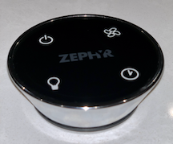

# ZephyrVentHood
 
HomeKit control of a ceiling-mounted <a href="https://zephyronline.com/product/lux-island-range-hood/">Lux Island</a> kitchen vent hood fan by Zephyr.  Runs on an ESP32 device as an Arduino sketch using the Arduino [HomeSpan Library](https://github.com/HomeSpan/HomeSpan).

Hardware used for this project:

* An ESP32 board, such as the [Adafruit HUZZAH32 – ESP32 Feather Board](https://www.adafruit.com/product/3405?gclid=EAIaIQobChMIh9-Rk4nx7QIVEvDACh0IRwiGEAYYBiABEgJSMPD_BwE)
* A simple 434 MHz RF Transmitter, such as this [RF Link Transmitter](https://www.sparkfun.com/products/10534) from SparkFun
* Two large pushbuttons (normally-open) to control the Zephyr fan and Zephyr light
* One small pushbutton (normally-open) to serve as the HomeSpan Control Button (optional)

Though the Lux Island Vent Fan is a rather esoteric appliance, the Arduino sketch used to control it is quite generic and can be readily modified to control any simple multi-button RF device that uses fixed codes (for an example of implementing rolling codes with HomeSpan, see my "universal" [Somfy Motorized Window Shade Controller](https://github.com/HomeSpan/SomfyRTS)).  More so, as described fully below, this appliction shows how real-world appliances don't always fit neatly into the ideal way HomeKit models the world.  To work around these limitations the sketch uses some internal state variable that allow one HomeKit Service to control another so that the status of the device in your Home App properly reflects the actual status of the appliance.  

### The Zephyr Kitchen Vent Hood with LED Lights

As part of a kitchen remodel we selected a <a href="https://zephyronline.com/product/lux-island-range-hood/">Lux Island</a> vent hood fan by Zephyr to install in the ceiling over a kitchen island cooktop.  The hood contains a very powerful 3-speed fan and sports LED lights to illuminate the cooking area below with 3 levels of brightness.  Since the entire unit is mounted directly in the ceiling, **there are no manual controls or buttons to turn it ON or OFF**.  Instead, Zephyr provides this stylistic RF remote control you're supposed to place on your countertop:

As shown, it's a simple 4-button remote with buttons for *power*, the *fan*, the *light*, and a timer control.  Unfortunately, it uses a psuedo-touch sensitive mechanism that is so finicky that there is only a 5% chance that it registers when you press the button.  A replacement remote from the manufacturer performed even worse and it was nearly impossible to get the remote to detect when you pressed one of the buttons.  This project was thus designed to both replace the Zephyr remote with a more robust device, as well as to provide HomeKit control so that you can activate the vent fan and light using Siri (useful when your hands are busy cooking and a pan starts to smoke).

### The RF Signals

Opening the remote revealed it was using a standard 433.92 MHz oscillator (it was printed on the oscillator itself).  Using an Arduino Mega (or an ESP32), the Arduino Serial Plotter (a terrific feature of the Arduino IDE!), and a 434 MHz receiver (such as this [RF Link Receiver](https://www.sparkfun.com/products/10532) from SparkFun) allows one to easily reverse-engineer the RF signals.  

Each button on the remote produces 8 repeats of a fixed pattern of 20 high/low pulses. Individual high/low pulses are 850𝛍s in duration, and there is a delay of 4ms between repeats of the pattern.  There are two types of pulses:  one is 230𝛍s high followed by 620𝛍s low, which can be arbitrarily assigned to represent a 0-bit; the other is 620𝛍s high followed by 230𝛍s low, which would represent a 1-bit.  Each button can therefore be represented by a 5 hex-digit code, such as 0x51388.

### Generating the RF Codes

The sketch uses HomeSpan's `RFControl` library to output a digital version of specific 20-bit patterns on a pin that is connected to the input of a 434 MHz transmitter (this sketch uses GPIO pin 22).  To create an RF signal corresponding to one of the buttons on the remote control, the code loads 20 high/low pulses into the ESP32's dedicated RMT (Remote Control) Memory using either an `add(230,620)` to represent a 0-bit or an `add(620,230)` to represent a 1-bit.  To create the 4ms delay between repeats of the pattern, the sketch adds an additional 4000 ticks to the second argument of the last bit loaded, yielding either an `add(230,4620)` or an `add(620,4230)` depending on whether the last bit was a 0 or 1.  The sketch then calls `start(8,1)`, which directs the ESP32 to generate 8 repeats of the preloaded pattern with 1 tick = 1 microsecond.

### Real-World Complications in the Idealized-World of HomeKit

The Zephyr Vent Hood has both a fan and a light, which should in principle be easy to replicate as a single Accessory with one Fan Service (configured for 3 speeds) and one Light Bulb Service (configured for 3 levels of brightness).  Unfortunately, the Zephyr Hood controls are not as clean, and the the fan and light operations are somewhat linked together as follows:

If both the fan and light are OFF:

* a press of the *power* button turns ON the fan to low speed; or
* a press of the *fan* button turns ON the fan to low speed; or
* a press of the *light* button turns ON the light to high brightness.

Pressing the *light* button when the light is already ON cycles the brightness high → medium → low → off, and then back to high.  Pressing the *fan* button when the fan is already ON cycles the speed low → medium → high, and then back to low.  Noteably, **there is no way to set the fan OFF by pressing the *fan* button**.

Instead, to turn the fan OFF, you need to press the *power* button.  But that also turns OFF the light, which leads to a linkage between the fan and light that is more complex than the idealized standalone Fan and Light Bulb Services in HomeKit.  For example, if the fan is OFF *and* the light is OFF, the fan comes ON when you press the *power* button.  But if the light is already ON and you press the *power* button, the light turns OFF, and nothing happens to the fan.

A second complication is that the Zephyr only allows you to cycle through speeds and brightness levels.  There is no remote control command that directs the Zephyr to set the fan to a specific speed or the light to a specific brightness.

Fortunately, a little bit of extra logic that takes advantage of Homespan's flexible service-oriented structure, and some practical compromise, is all that is needed to solve for these complications.

### Implementing the Code

The code uses HomeSpan to implement a Fan Service and LightBulb Service.  Both Services are configured only for ON/OFF functionality; there is no speed control for the fan, and no brightness control for the light.  Instead, fan speed and light brightness is controlled with two separate pushbuttons implemented using HomeSpan's `SpanButton()` object.

The Fan Service is programmed to send the RF signal corresponding to the *fan* button on the Zephyr remote control when the user requests the fan to turn ON.  This causes the Zephyr Vent Hood to set the fan to low speed, but has no effect on the light (which is good).  Requests to turn ON the fan when the fan is already running are ignored.  This is because sending another RF *fan* signal would change the speed instead.

Similarly, the LightBulb Service is programmed to send the RF signal corresponding to the *light* button on the Zephyr remote control when the user requests the light to turn ON.  This causes the Zephyr Vent Hood to set the light to high brightness, but has no effect on the fan (which is also good).  Requests to turn ON the light when the light is already ON are ignored.  This is because sending another RF *light* signal would change the brightness of the light, including possibly shutting it OFF, which is the *opposite* of what the user intended (this is not good!).

Both the Fan and LightBulb Service are programmed to send the RF signal corresponding to the *power* button on the Zephyr remote control when the user requests either to be turned OFF.  Since this RF signal causes the Zephyr Vent Hood to turn OFF both the fan and the light (provided at least one of them are on), the `update()` method for each Service includes logic to set a *global-scoped* boolean variable that is monitored in the `loop()` method of the *other* Service.

For example, when the user requests the fan to be turned OFF, the `update()` method in the Fan Service sends the RF *power* button signal and sets the boolean variable `resetLight` to `true`.  The LightBulb Service monitors this variable in its `loop()` function, and if true it simply resets its internal status to OFF with the `setVal()` method.  HomeSpan automatically sends an event notificaton to HomeKit when `setVal()` is used so that HomeKit will properly reflect the fact that the light is now OFF.

This same logic also applies in the other direction, so that if the user requests the light to turn OFF, the LightBulb Service sends the RF *power* signal and sets the boolean variable `resetFan` to `true`.  The Fan Service picks this up in its `loop()` method and changes its state to OFF with `setVal()`, which also triggers an event notification of the status change back to HomeKit.

Additional logic is added to both Services so that requests to turn OFF a Service that is already OFF are ignored.  This is because sending the RF *power* signal when the service is already OFF will either cause the *other* service to turn OFF (if it is on), or it will turn ON both services if both are already OFF, which is very much the opposite of the users intention.

To control fan speed and light brightness, two `SpanButton()` objects, representing two physical pushbuttons, are programmed to mimic the functionality of the original remote, but with more intuitive logic.  This sketch uses a pushbutton connecting GPIO pin 18 to ground for the fan control, and a pushbutton connecting GPIO 19 to ground for the light control.  Pressing the fan pushbutton when the fan is OFF sends an RF *fan* signal so that the Zephyr Vent Hood turns the fan ON.  The code within the `button()` method also sets the state of the device to ON with the `setVal()` method, which (as always) sends an event notification to HomeKit so it also knows the device is now ON.  Subsequent presses of the fan pushbutton cause the Fan Service to send additional RF *fan* signals, which cycles the fan speed low → medium → high, and then back to low.  These subsequent presses do not impact any HomeKit logic since, as described above, we are not using HomeKit to set or track the speed of the fan.

The light button operates in a similar fashion but requires additional logic since cycling through the different brightness levels includes a "fully off" level.  The LightBulb Service keeps track of this via an internal state variable called `state`.  Whenever the LightBulb Service records a light pushbutton press that results in the light cycling from the lowest brightness level to OFF, it uses `setVal()` to update the light status to OFF and sends a corresponding event notification to HomeKit. 

Finally, to turn the fan OFF with the fan pushbutton, or to turn the light OFF with the light pushbutton, the Services are programmed to also react to LONG pushbutton presses (HomeSpan's `SpanButton` method supports SINGLE, DOUBLE, and LONG button presses).  When it detects a LONG press, it sends the RF *power* signal to turn OFF the Zephyr Vent Hood, following the same logic as above so that it only sends the signal if the service is already ON.  This same logic also updates the status of *both* services to OFF with the `setVal()` method, regardless of which pushButton is pressed, since the RF *power* signal shuts OFF both the fan and the light (provided at least one of them is ON).

In this fashion, the ON/OFF status of the fan and the light in HomeKit stays in perfect sync with the actual status of the fan and light in the real world, whether the user operates the fan or light from the Home App, via Siri, or by using the physical pushbuttons.

Though the logic above may seem somewhat complicated, the code itself should be fairly straightforward, and in some ways easier to follow.  This sketch is also sufficiently generic and flexible that you should be able to modify it to create your own custom HomeKit controls for any multi-button remote (either RF or IR) that uses fixed (static) codes.

Happy HomeKitting!

---

### Feedback or Questions?

Please consider adding to the [Discussion Board](https://github.com/HomeSpan/HomeSpan/discussions), or email me directly at [homespan@icloud.com](mailto:homespan@icloud.com).
